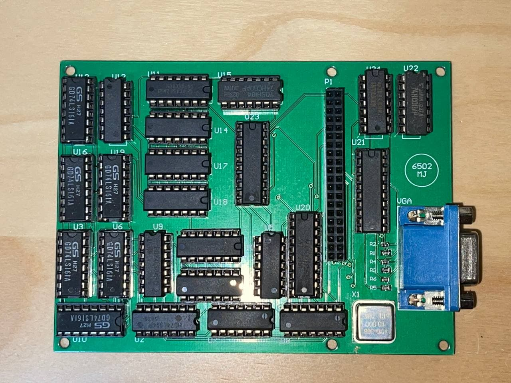

# 6502 Computer based on Ben Eater

While following along Ben Eater's 6502 video series, I attempted to follow along with a breadboard version. However, I found that connecting wires across the breadboard was often confusing and I had to debug a mis-connection more than once. To make things easier on myself, I set out to design my own PCB, following the schematics he had posted on his [website](https://eater.net/6502).

Note that there are two revisions of these boards, as I found some mistakes when fabricating Revision A. In Revision B, I fixed the crystal oscillator footprints (accidentally mirrored them) and 

## 6502 Main PCB

The main PCB follows Ben Eater's 6502 series, comprising the 6502 processor, 62256 SRAM, 28C256 EEPROM, and 65C22 Interface Adapter. Additionally, I incorporated his 555 based clock generator, and PS2 interface. The schematic for this PCB is available [here](PCBs/Rev-B/6502/6502.pdf).

## VGA PCB

This follows Ben Eater's [World's Worst Video Card](https://eater.net/vga) series. This comprises a bunch of 74-series logic gates to count VGA clock pulses, which is used to generate appropriate `HSYNC` and `VSYNC` signals for a screen resolution of 200x150 at 10MHz. The schematic for this PCB is available [here](PCBs/Rev-B/6502_VGA/6502_VGA.pdf).

## EEPROM Programmer

This is simply a PCB version of the [EEPROM Programmer](https://github.com/beneater/eeprom-programmer). The schematic for this PCB is available [here](PCBs/Rev-B/EEPROM_Programmer/EEPROM_Programmer.pdf).

## Ordering the PCBs

Zip the contents of the "fabrication" folders, that will be the Gerber files you send to your PCB manufacturer. I recommend getting the SMT components (passives, LEDs, USB-C connectors) assembled for you as it can be a pain to solder them without a hot air gun. Get the files for the [6502 Carrier Board](PCBs/Rev-B/6502/fabrication), [VGA Board](vga/../PCBs/Rev-B/6502/fabrication) and [EEPROM Programmer Board](eeprom_programmer/../PCBs/Rev-B/EEPROM_Programmer/fabrication).

For the components, I recommend you buy them from Ben Eater's store for the [6502](https://eater.net/6502), [Clock module](https://eater.net/shop), the [VGA Board](https://eater.net/vga), [EEPROM Programmer (TL866)](https://eater.net/shop). The components for the PS2 circuit are not yet available from his store; you'll need to buy the 74-series logic chips yourself. If you want to buy the components yourself, I still recommend at least getting the 6502 kit and the EEPROM programmer from his store, as I've found that it can be hard to buy genuine "W65C02" chips.